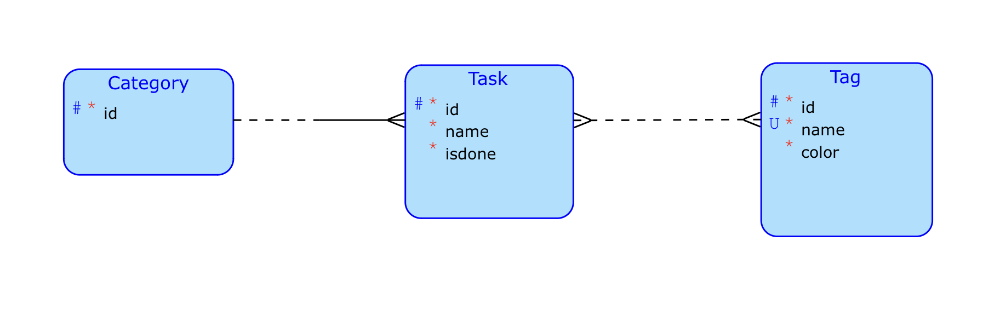

# BI-TJV-svobov25-semestralni-prace

I will develop a simple to-do list client-server app. It shall consist of a REST authentication with a username and a password,
the ability for each user to create their tasks through a form and assign them a tag, and the possibility of later modification of existing tasks. The complex client-side business operation is the ability to create a new tag while adding or modifying the task. Each task can be marked or unmarked as done.

## Client 

todo

## Server

todo

## Data model

